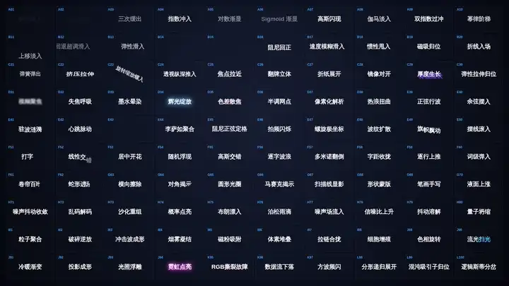
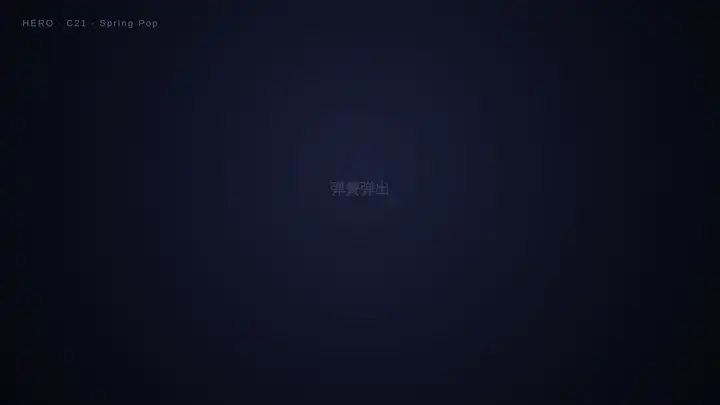
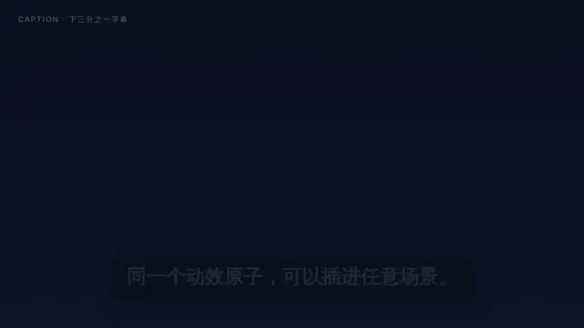
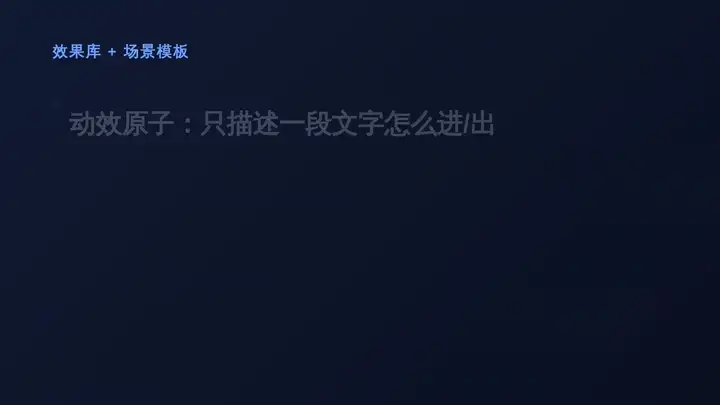
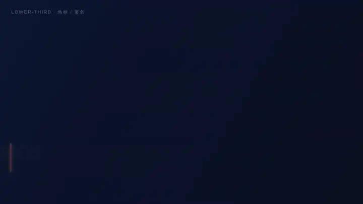
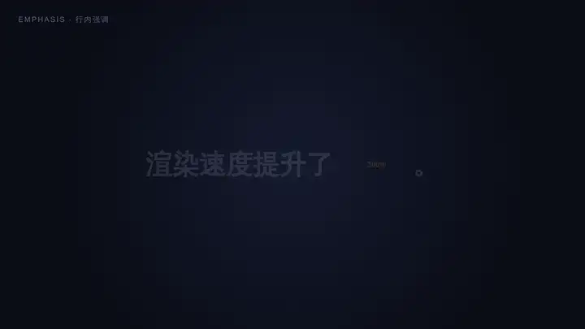
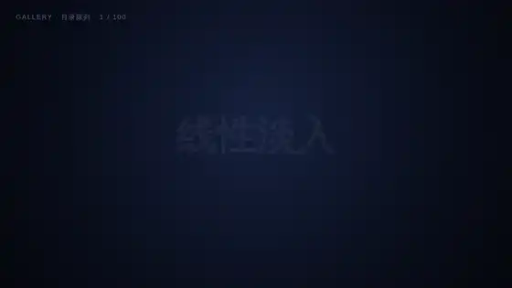
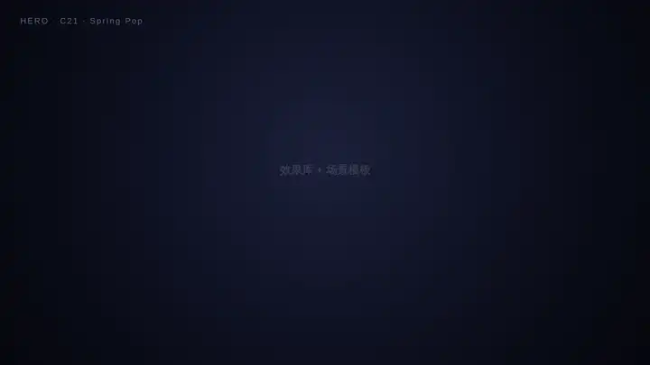

<p align="right"><a href="./README.md">简体中文</a> · <strong>English</strong></p>

# RemotionMG · Text-Effect Library + Scene Templates

> A text entrance/exit animation system built with [Remotion](https://www.remotion.dev/): **100 pure effect atoms** (different math expressions × creativity) + **9 scene templates**.
> Two decoupled layers — *effects only describe "how a single piece of text enters/exits", scenes only handle "layout / role / dwell / stacking"* — so any effect can be dropped into any scene.
> Every scene is **props-driven**, so other AIs / programs can **render with zero code changes by passing JSON**.



> Above: the `SceneWall` dynamic preview wall — all 100 effects looping in sync on a grid. For a single-image overview see [`docs/thumbnails-contact-sheet.png`](docs/thumbnails-contact-sheet.png).

---

## 30-second start

```bash
npm i
npm run dev          # opens Remotion Studio; pick a composition to preview / tweak props
# render any scene (pass JSON props, no code changes needed):
npx remotion render src/index.ts SceneHero out.mp4 \
  --props='{"entries":[{"text":"Your Title","effectId":21}],"timing":{"inF":22,"holdF":40,"outF":18},"background":"#101225","color":"#fff","fontSize":200}'
```

- **Browse the effects**: [`docs/preview.html`](docs/preview.html) (open in a browser; searchable / click to enlarge) or [`docs/effects.json`](docs/effects.json) (machine-readable).
- **Have an AI call it**: read [`docs/ai-usage.md`](docs/ai-usage.md) (copy-paste props examples per scene).
- **Understand the design / math**: read [`docs/font-entrance-effects-100.md`](docs/font-entrance-effects-100.md) (effect / formula / creative variants for all 100).

---

## Theme Configurator · Zero-code video production

Open [`docs/configurator.html`](docs/configurator.html) (pure static HTML, works directly in browser) to configure everything visually:

1. **Pick a theme** — 5 presets (Glitch / Soft / Bouncy / Minimal / Elegant), one click to switch colors, fonts, and motion style
2. **Edit content** — Fill in text by scene role (Hero / List / LowerThird / Caption / Emphasis)
3. **Tune parameters** — Timing sliders (in/hold/out frames), color overrides, per-scene effectId overrides
4. **Live preview** — Right-side canvas plays the animation in real time
5. **Export ZIP** — One button to get a **self-contained Remotion project**

### Self-contained ZIP export

The exported ZIP is a **fully runnable Remotion project** — no need to clone this repository:

```
theme-glitch/
├── theme.json              ← Theme config (the only file you need to edit)
├── AI_INSTRUCTIONS.md      ← AI usage guide (with effectId lookup table)
├── README.md               ← Human-readable summary
├── package.json            ← Dependencies
├── tsconfig.json / remotion.config.ts
└── src/                    ← Full rendering engine source
    ├── index.ts, Root.tsx
    ├── effects/            ← 100 effect atoms
    └── textfx/             ← Scene components + types + theme definitions
```

Usage:

```bash
# After extracting
npm install
npx remotion render src/index.ts SceneTheme out.mp4 --props=@theme.json
# Or launch interactive preview
npm run dev
```

#### Smart scene pruning

The ZIP only includes scene components for which you actually configured content. For example, if you only filled in Hero and Caption → the ZIP will not contain `ListScene.tsx`, `LowerThirdScene.tsx`, or `EmphasisScene.tsx`, resulting in a smaller and cleaner package.

#### AI-friendly

The exported `AI_INSTRUCTIONS.md` includes:
- One-liner render command
- `theme.json` config reference (change text, switch theme, adjust timing, override colors/effects)
- effectId 1-100 category lookup table (A-L, 12 families)
- Remotion Studio interactive preview instructions
- Advanced render formats (MP4 / GIF / PNG sequence)

Hand the extracted folder to any AI — it reads `AI_INSTRUCTIONS.md` and immediately knows how to use and modify the project.

---

## Architecture: effect atoms × scene templates

```
                ┌──────────────── 100 effect atoms (src/textfx/library.tsx) ────────────────┐
                │  A Opacity curves · B Easing/Motion · C 3D transform · D Blur · E Trig wave │
   TextEffect → │  F Per-char stagger · G Clip mask · H Noise · I Particles · J Color/Light   │
   (pure in/out)│  K Glitch · L Fractal/Chaos                                                 │
                └──────────────────────────────┬───────────────────────────────────────────┘
                                                │  effectId ∈ [1,100]
                ┌──────────────────────────────▼───────────────── 9 scene templates ─────────┐
                │  Hero · Caption · List · LowerThird · Emphasis                              │
                │  Gallery (catalog) · Reel (stitched film) · Thumb · Wall (preview grid)     │
                └───────────────────────────────────────────────────────────────────────────┘
```

Each effect atom implements a single function — given a phase `phase ∈ {'in','out'}` and progress `t ∈ [0,1]`, it returns the visual applied to the text:

```ts
type TextEffect = {
  id; category; name; enName; formula;
  visual(a: {text; phase; t; frame; seed}): {wrapper?: CSSProperties; content?: ReactNode};
};
// unified presence: presence(phase, t) = phase === 'in' ? ease(t) : 1 - ease(t)
```

Scene templates own layout / role / dwell / stacking and render via `<TextFx effect={...} phase t .../>`.
The same atom (e.g. "scramble decode" `effectId=72`) can be an explosive Hero title, a soft Caption, or an Emphasis keyword.

---

## Scenes (with previews)

| Composition ID | Role | props entry | Preview |
|---|---|---|---|
| `SceneHero` | Hero title: single oversized centered line, dramatic in/out | `entries[]` | below |
| `SceneCaption` | Caption: lower third, quick in/out, in-place replace | `lines[]` | below |
| `SceneList` | Build list: items appear sequentially and accumulate | `items[]` | below |
| `SceneLowerThird` | Lower-third / credit: branded bar, slide in-hold-out | `entries[]` | below |
| `SceneEmphasis` | Inline emphasis: a word in a sentence pops in | `lines[]` | below |
| `SceneGallery` | Catalog: sequentially showcases the library + history stack | `effectIds[]` | below |
| `SceneReel` | Stitched film: multiple scenes played in sequence | `segments[]` | below |
| `SceneThumb` | Thumbnail: static single-atom preview | `effectId` | — |
| `SceneWall` | Dynamic preview wall: all effects looping in sync | `effectIds[]` | top |

### Hero


### Caption


### List


### LowerThird


### Emphasis


### Gallery


### Reel (intro → list → lower-third → caption → emphasis → outro)


---

## Configurable scene parameters

Besides `entries/lines/items` (text + `effectId`), each scene accepts these **optional** props for typography and position (omit to keep defaults; fully backward-compatible):

| Param | Type | Meaning | Scenes |
|---|---|---|---|
| `fontSize` | number | font size (px) | all text scenes |
| `fontWeight` | number | weight (100–900) | Hero/Caption/List/Emphasis/LowerThird |
| `fontFamily` | string | font family | same as above |
| `letterSpacing` | number | letter spacing (px) | same as above |
| `align` | `'left'\|'center'\|'right'` | horizontal align | Hero/Caption/Emphasis |
| `vAlign` | `'top'\|'center'\|'bottom'` | vertical align | Hero |
| `offsetX` / `offsetY` | number | position offset (px) | Hero/Caption/LowerThird |
| `subSize` / `subColor` | number / string | subtitle size / color | Hero |
| `showLabel` | boolean | show top-left scene label | all |
| `background` / `color` / `accent` | string | background / foreground / accent color | per scene |

Example (left-aligned, top, thin weight, cyan, custom size + position):

```bash
npx remotion render src/index.ts SceneHero out.mp4 --props='{
  "entries":[{"text":"Top-left Title","sub":"custom","effectId":21}],
  "timing":{"inF":22,"holdF":40,"outF":18},
  "background":"#0c0e1c","color":"#7fe3ff",
  "fontSize":120,"fontWeight":400,"letterSpacing":8,
  "align":"left","vAlign":"top","offsetX":40,"offsetY":20,"showLabel":false
}'
```

## Calling from another AI

1. Read [`docs/effects.json`](docs/effects.json) to pick an `effectId` (each has `category/name/enName/formula/thumbnail`).
2. Read [`docs/ai-usage.md`](docs/ai-usage.md) for the props shape of each scene.
3. Render: `npx remotion render src/index.ts <SceneId> out.mp4 --props='<JSON>'`; duration is computed automatically by `calculateMetadata` from the props.

**Stitched film** (one command for a full video):

```bash
npx remotion render src/index.ts SceneReel reel.mp4 --props='{
  "segments":[
    {"type":"hero","props":{"entries":[{"text":"Intro","effectId":21}],"timing":{"inF":20,"holdF":34,"outF":16},"background":"#0c0e1c","color":"#fff","fontSize":150}},
    {"type":"caption","props":{"lines":[{"text":"A line of narration","effectId":51}],"timing":{"inF":10,"holdF":44,"outF":8},"background":"#0a1020","barColor":"rgba(10,14,26,0.72)","color":"#f2f6ff","fontSize":60}},
    {"type":"hero","props":{"entries":[{"text":"Thanks","effectId":34}],"timing":{"inF":20,"holdF":36,"outF":18},"background":"#0c0e1c","color":"#fff","fontSize":170}}
  ]
}'
```

---

## Quick effect picking (for humans)

| Method | File / command | Best for |
|---|---|---|
| Static overview | [`docs/thumbnails-contact-sheet.png`](docs/thumbnails-contact-sheet.png) | scan all 100 mid-states at once |
| Clickable preview page | [`docs/preview.html`](docs/preview.html) | categorized grid + search + enlarge |
| Dynamic preview wall | `SceneWall` composition | see everything "in motion" |
| Interactive realtime | `npm run dev` → `SceneThumb`, change `effectId` | preview one by one |

---

## Repository layout

```
src/textfx/
  types.ts            core types: Phase / TextEffect / EffectVisualArgs
  shared.tsx          shared building blocks: presence / PerChar / Scramble / math utils
  library.tsx         100 effect atoms (exports EFFECTS / effectById)
  TextFx.tsx          renderer: combines "effect atom + scene baseStyle"
  schemas.ts          per-scene Zod schemas + duration functions
  presets.ts          per-scene default props (i.e. AI calling examples)
  manifest.ts         machine-readable manifest source (incl. thumbnail paths)
  index.ts            unified barrel export
  scenes/             9 scene templates
docs/
  configurator.html              theme configurator (visual config + self-contained ZIP export)
  font-entrance-effects-100.md   100-effect design + math reference
  ai-usage.md                    AI usage guide (props examples)
  effects.json                   machine-readable manifest (100 effects + 9 scenes)
  preview.html                   clickable preview page
  thumbnails/                    100 effect thumbnails
  thumbnails-contact-sheet.png   thumbnail overview
  media/                         scene preview animations embedded in README/docs
scripts/
  gen-manifest.ts     generates effects.json
  gen-thumbnails.mjs  batch-renders the 100 thumbnails
  gen-preview-html.mjs generates preview.html
```

## Common commands

```bash
npm run dev             # Remotion Studio preview
npm run typecheck       # tsc --noEmit
npm run gen:manifest    # regenerate docs/effects.json
npm run gen:thumbnails  # re-render the 100 thumbnails (run npm i first)
npm run gen:preview     # regenerate docs/preview.html
```
